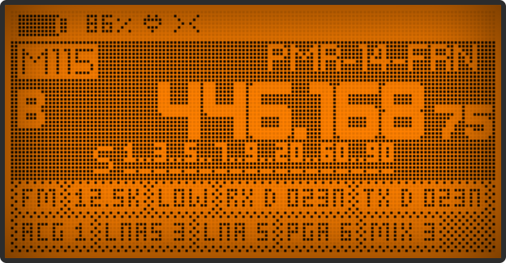
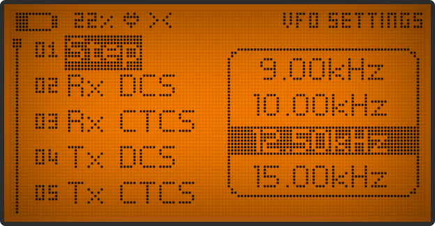
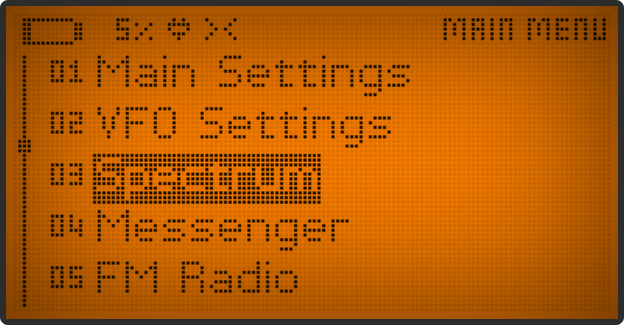
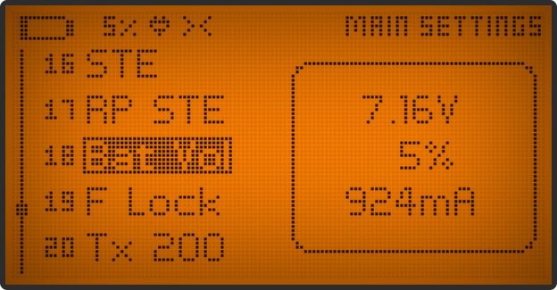
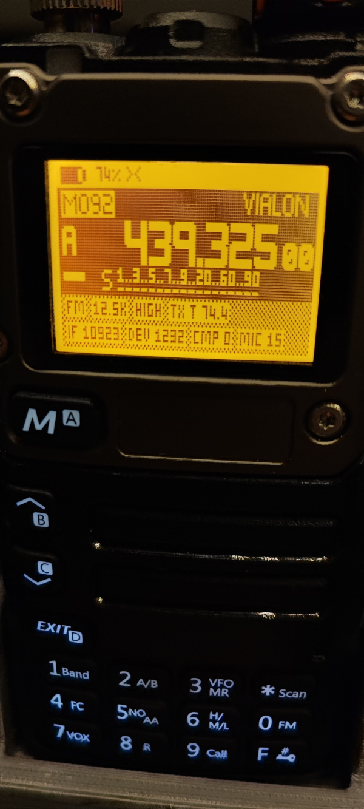

# UV-K5 Open Radio Firmware

## ..... Work in PROGRESS - not for everyday use

> [!WARNING]  
> To test this version you must bear in mind that it can corrupt the data in the eeprom, so you must make a backup before using this version.
> 
> **In this version, many of the core components are being rewritten, not all features will be available and may never be.**
>
> **If you want to have a more stable FW and even with more features, I advise you to look at other options.**

## Major changes in this version

- New graphic functions and fonts, based on Adafruit-GFX-Library
- New interface
- Using FreeRTOS
- and others....

## Key functions

In VFO

- M = Current VFO settings
- F + M = Main Menu
- F + 4 = Bandwidth
- F + 5 = Modulation
- F + 6 = TX Power

## Open implementation of the Quansheng UV-K5/K6/5R firmware

Based on _egzumer_ repository and the work of DualTachyon's open firmware found [here](https://github.com/DualTachyon/uv-k5-firmware) ... a cool achievement !

> [!WARNING]  
> _Use this firmware at your own risk (entirely). There is absolutely no guarantee that it will work in any way shape or form on your radio(s), it may even brick your radio(s), in which case, you'd need to buy another radio._

> [!WARNING]
> _After some unfortunate incidents by users I'm going to put this warning and disclaimer up. DO NOT attempt to transmit without the proper precautions in place. Transmitting 5W of RF energy centimetres away from a PC can LITERALLY destroy it, it's almost like an EMP at that distance. Get your antenna away from the PC._

Anyway, have fun.

## Build in windows

make clean

make

make prog COMPORT=com4

## Credits

Many thanks to various people:

- [egzumer](https://github.com/egzumer/uv-k5-firmware-custom)
- [DualTachyon](https://github.com/DualTachyon)
- [Mikhail](https://github.com/fagci)
- [@Matoz](https://github.com/spm81)
- [OneOfEleven](https://github.com/OneOfEleven)
- [fagci](https://github.com/fagci)

## Other sources of information

[ludwich66 - Quansheng UV-K5 Wiki](https://github.com/ludwich66/Quansheng_UV-K5_Wiki/wiki) 
[amnemonic - tools and sources of information](https://github.com/amnemonic/Quansheng_UV-K5_Firmware)

## License

    Copyright 2023 Dual Tachyon
    https://github.com/DualTachyon

    Copyright 2024 joaquim.org
    https://github.com/joaquimorg

    Licensed under the Apache License, Version 2.0 (the "License");
    you may not use this file except in compliance with the License.
    You may obtain a copy of the License at

    http://www.apache.org/licenses/LICENSE-2.0

    Unless required by applicable law or agreed to in writing, software
    distributed under the License is distributed on an "AS IS" BASIS,
    WITHOUT WARRANTIES OR CONDITIONS OF ANY KIND, either express or implied.
    See the License for the specific language governing permissions and
    limitations under the License.
